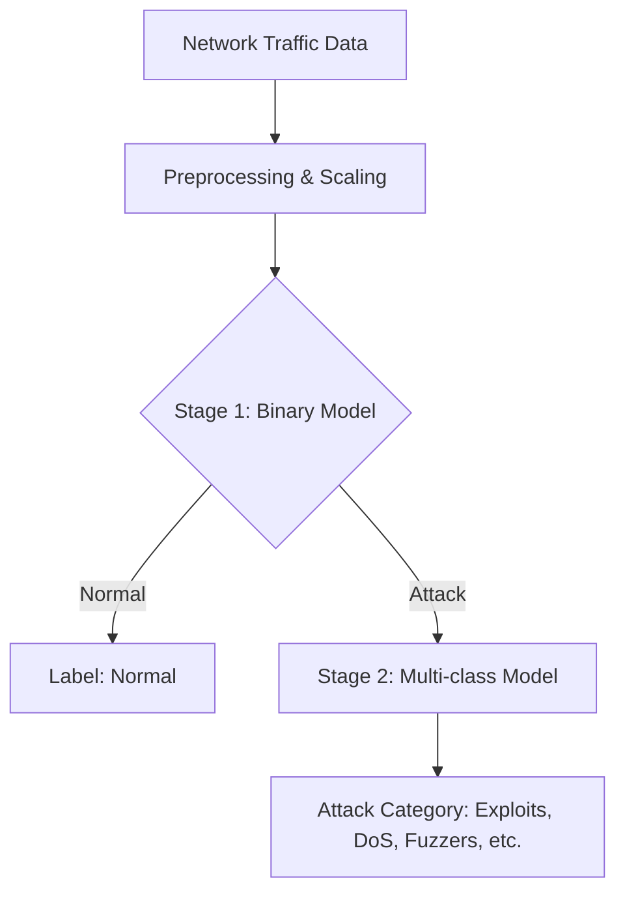

# AI-Powered Network Intrusion Detection System (NIDS)

[](https://www.python.org/)
[](https://scikit-learn.org/)
[](https://xgboost.ai/)
[](https://skops.readthedocs.io/)

A professional machine learning pipeline for network intrusion detection using the **UNSW-NB15 dataset**. This project implements a hierarchical cascade architecture to achieve high precision in both threat detection and attack classification.

## 🚀 Key Features

- **Hierarchical Cascade Architecture**: Uses a binary "gate" model to isolate traffic before multi-class classification.
- **Secure Model Persistence**: Implements `skops` instead of `pickle` to ensure secure serialization and prevent arbitrary code execution—a critical standard for cybersecurity applications.
- **Advanced Preprocessing**: Comprehensive feature scaling, categorical encoding, and SMOTE-based class balancing.
- **Portfolio-Ready Structure**: Organized according to industry best practices for ML repositories.

## 🏗 Architecture

The system uses a two-stage hierarchical approach to maximize detection accuracy:



### v2 Improvements
- **Stacking Ensemble**: Explored LGBM + XGB + CatBoost base learners.
- **Per-class Threshold Tuning**: Optimized probability cut-offs to maximize Macro F1.
- **Feature Engineering**: Added ratio and log-transformed flow statistics.

## 🛡 Model Security

> [!IMPORTANT]
> **Why `skops`?**
> Standard Python serialization (like `pickle` or `joblib`) is fundamentally insecure because it can execute arbitrary code during loading. In a cybersecurity context, this is a major vulnerability. This project uses **`skops.io`**, which provides a secure way to share models by only allowing trusted types to be deserialized.

## 📊 Results Summary

- **Binary Detection**: XGBoost achieves an **F1-score of 0.9303** and **ROC-AUC of 0.9808**.
- **Multi-class Identification**: Hierarchical approach significantly improves detection of rare attack families compared to flat models.

## 📂 Project Structure

```text
kaggle_ai_cybersecurity/
├── main.py                 # Main entry point for training & evaluation
├── src/                    # Source code directory
│   ├── __init__.py
│   └── nids_model.py       # Hierarchical model class & skops logic
├── notebooks/              # Jupyter notebooks for EDA & exploration
│   ├── k_security.ipynb
│   └── k_security_v2.ipynb
├── models/                 # Secure serialized model files (.skops)
├── data/                   # Dataset storage (Parquet/CSV)
├── reports/                # Evaluation results and visualizations
├── requirements.txt        # Project dependencies
└── .gitignore              # Git exclusion rules
```

## 🛠 Installation & Usage

### 1. Setup Environment
```bash
# Clone the repository
git clone https://github.com/simgsr/kaggle_ai_cybersecurity.git
cd kaggle_ai_cybersecurity

# Install dependencies
pip install -r requirements.txt
```

### 2. Train and Evaluate
```bash
python main.py
```

### 3. Using the Model Securely
```python
from src.nids_model import HierarchicalNIDS

# Load the model securely
nids = HierarchicalNIDS.load('models/nids_hierarchical_v2.skops')

# Perform inference
predictions = nids.predict(new_data_df)
```

## 📜 Dataset Reference
**UNSW-NB15**: A modern network intrusion dataset with 9 attack categories.
- **Training Records**: 175,341
- **Testing Records**: 82,332
- **Features**: 34 numeric and categorical features.

---
*Developed as a showcase for AI in Cybersecurity Portfolio.*
